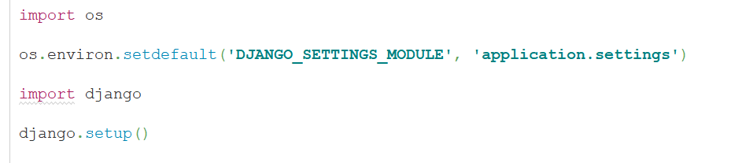

其实不需要这个demo，funboost 和django  flask  fastapi 任意web框架搭配没有任何区别，
但是有的人老是爱问 funboost 怎么和某某web框架搭配，那就写一个项目。

funboost 和django搭配不像 django_celery 还要专门特意搞个三方插件包，完全不需要，在任何web框架中使用funboost都没有需要专门学习的三方插件包。 

# 1 启动django服务

1.1) cd切换到项目根目录 

1.2) set  PYTHONPATH=./       
(如果是linux或者mac  export PYTHONPATH=./ )

1.3) uvicorn djangoProject.asgi:application


然后浏览器访问 http://127.0.0.1:8000/index  ,这样就能 views.py 的 test视图函数发布消息到队列了。


# 1.2 带orm操作的funboost+django demo

有的人不懂消费函数中操作了orm,看这个项目.

[funboost_django_orm_demo](https://github.com/ydf0509/funboost_django_orm_demo)

# 2 启动后台消费

2.1) cd切换到项目根目录 

2.2) set  PYTHONPATH=./  
( 如果是linux或者mac  export PYTHONPATH=./ )

2.3)  python3 run_conusme.py


如果函数中操作了django orm 或其他需要使用django上下文的，需要在消费代码中先添加例如以下代码。



其中DJANGO_SETTINGS_MODULE 的值就是  django 项目自动生成的 manage.py 里面的代码。 


# 3 部署说明

如上所示

web部署一次，消费部署一次。web接口中发布消息到消息队列，在另外的脚本中启动消费单独部署。

```
不要老是非要把web和后台消费一次启动部署，这是用消息队列解耦的，不需要部署在一起。

真的是不想增加这个demo说明，这个分开部署模式和 fastapi+funboost  flask+funboost是一摸一样的分web和消费两次部署，有的人不能举一反三。

```
